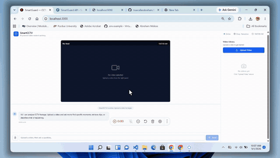
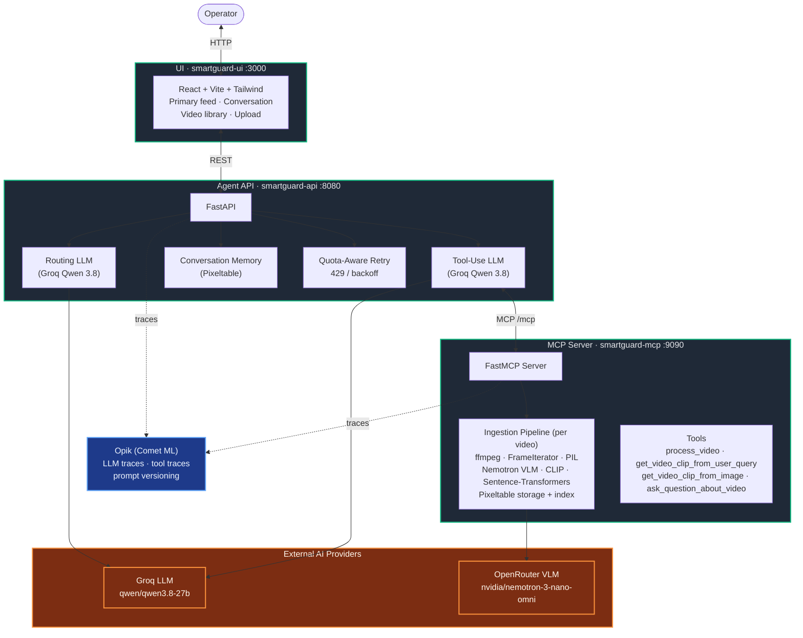

# SmartGuard

### Multimodal AI agent for transit CCTV incident auditing

A production-grade agent system that ingests surveillance footage, captions every frame with a Vision-Language Model, indexes the result for semantic search, and lets operators investigate incidents through natural-language chat. Built end-to-end on **MCP, FastAPI, Pixeltable, Groq, OpenRouter, and Opik**.

</div>

---

## Why this matters

Public transit systems produce thousands of hours of CCTV daily. When an incident happens — a fall, a fight, an unattended bag — operators have to scrub footage by hand. Slow, error-prone, and it doesn't scale.

SmartGuard turns a multi-hour manual review into a **seconds-long natural-language query**:

> *"Show me the moment a car back door is opened."*
> → Agent searches the indexed captions, locates the frame, trims the matching clip with ffmpeg, returns a playable video.

---

## What it does

| Capability | Result |
|---|---|
| **Frame-level captioning** | Every frame is described by a VLM (NVIDIA Nemotron 3 Nano Omni) using a transit-safety prompt that flags fights, falls, unattended bags, crowd crush, vandalism, fare evasion, and slip-and-fall hazards. |
| **Semantic search over footage** | Sentence-Transformers + CLIP embeddings over captions and frames. Find a moment by describing it in plain English. |
| **Tool-use agent** | A Groq-powered LLM agent with routing → tool-use → general-response flow. Decides when to call a tool, calls it, synthesizes the answer. |
| **Clip extraction** | ffmpeg-based trimming at the matched start/end timestamps. Returns a playable video clip. |
| **Reference-image search** | Paste a screenshot of a person of interest — find every similar frame in the indexed video. |
| **End-to-end observability** | Every LLM call, tool invocation, and memory operation is traced in Opik with prompt versioning for full audit trails. |

---

## Architecture (one screen)



Three independently deployable services (UI, Agent API, MCP Server) communicate over HTTP. The MCP Server is the data-processing backbone (frame extraction, VLM captioning, embedding indexes via Pixeltable). The Agent API is the tool-use LLM (routing + tool selection + response synthesis). The UI is the operator console.

---

## End-to-end flow

```
Operator uploads CCTV footage
        ↓
MCP Server ingests it:
  1. ffmpeg / PyAV re-encode for compatibility
  2. FrameIterator extracts frames
  3. PIL resizes to 1024x768
  4. NVIDIA Nemotron VLM captions each frame (transit-safety prompt)
  5. CLIP builds image embeddings
  6. Sentence-Transformers builds text embeddings on captions
  7. Pixeltable stores and indexes everything
        ↓
Operator asks: "Show me the clip where the back of the car door is opened"
        ↓
Agent API:
  1. Router LLM (Groq) decides: yes, this needs a tool
  2. Tool-Use LLM (Groq) selects get_video_clip_from_user_query
  3. MCP call searches captions by similarity
  4. ffmpeg trims the matching segment
  5. LLM synthesizes the response
  6. Returns: message + clip path
        ↓
Operator sees the response and plays the clip
        ↓
Opik has the full trace for audit
```

---

## Live Demo

The animated preview above shows the real working application. The full 4K master recording is at [static/Cap 2026-09-01 at 10.09.02.mp4](static/Cap 2026-09-01 at 10.09.02.mp4).

---

## What I built (highlights for a hiring manager)

- **Shipped a working end-to-end multimodal agent system** — three services, real LLM and VLM calls, real ffmpeg clip extraction, real semantic search. Not a mockup.
- **Production-quality error handling** — quota-aware retry with exponential backoff (catches both `openai.RateLimitError` and `InstructorRetryException`), tool call history appending for Gemini/OpenAI-compat quirks, robust empty-result handling in search tools.
- **Provider-agnostic by design** — switched the LLM from Gemini to Groq and the VLM from Gemini to OpenRouter without rewriting any agent code, because everything goes through the OpenAI SDK.
- **Full observability** — every LLM call, tool invocation, memory operation, and prompt version is traced in Opik for compliance auditing.
- **Real ops considerations** — absolute video paths so the MCP server (different CWD) can find uploaded files, ffmpeg binary resolved with fallbacks for background processes without PATH, LFS for large media, file-name sanitization for Windows.

---

## Tech Stack

| Layer | Technology | Why |
|---|---|---|
| **MCP Server** | FastMCP 2.5+ | Standard protocol for tool/prompt/resource exposure |
| **Video processing** | Pixeltable 0.4+ | Multimodal data tables, computed columns, embedding indexes |
| **Video I/O** | ffmpeg 7.x + PyAV 18.x | Frame extraction, audio handling, clip trimming, re-encoding |
| **VLM** | NVIDIA Nemotron 3 Nano Omni (OpenRouter) | Vision-language captioning with incident detection |
| **LLM** | Groq `qwen/qwen3.8-27b` (OpenAI-compat) | Agent routing, tool selection, general chat |
| **Embeddings** | CLIP + Sentence-Transformers | Image and text similarity search |
| **Agent framework** | Instructor + OpenAI SDK | Structured outputs (JSON mode), tool calling |
| **Agent API** | FastAPI + Uvicorn | Async REST with background task processing |
| **Observability** | Opik (Comet ML) | LLM/tool traces + prompt versioning |
| **UI** | React 18 + Vite 5 + Tailwind 3 | Operator console, conversation panel, video library |
| **Language** | Python 3.12+ / TypeScript 5+ | End-to-end type safety |

---

## Configuration

All configuration is via environment variables (`.env` files). **No keys are hardcoded in source code.**

### MCP Server (`smartguard-mcp/.env`)

| Variable | Default | Description |
|----------|---------|-------------|
| `OPENAI_API_KEY` | *(required)* | OpenRouter API key (used for VLM captioning) |
| `OPENAI_BASE_URL` | `https://openrouter.ai/api/v1` | OpenAI-compatible endpoint (OpenRouter) |
| `OPIK_API_KEY` | *(required)* | Opik/Comet ML API key for tracing + prompt versioning |
| `OPIK_WORKSPACE` | `default` | Opik workspace name |
| `OPIK_PROJECT` | `smartguard-mcp` | Opik project name |
| `IMAGE_CAPTION_MODEL` | `nvidia/nemotron-3-nano-omni-30b-a3b-reasoning:free` | VLM model for frame captioning |
| `AUDIO_TRANSCRIPT_MODEL` | `nvidia/nemotron-3-nano-omni-30b-a3b-reasoning:free` | Audio transcription model (currently unused) |
| `SPLIT_FRAMES_COUNT` | `2` | Number of frames to extract per video |
| `AUDIO_CHUNK_LENGTH` | `10` | Audio chunk duration in seconds |
| `CAPTION_MODEL_PROMPT` | *(transit-safety prompt)* | VLM prompt for frame captioning |
| `TRANSCRIPT_SIMILARITY_EMBD_MODEL` | `sentence-transformers/all-MiniLM-L6-v2` | Text embedding model for transcripts |
| `IMAGE_SIMILARITY_EMBD_MODEL` | `openai/clip-vit-base-patch32` | CLIP model for image similarity |
| `CAPTION_SIMILARITY_EMBD_MODEL` | `sentence-transformers/all-MiniLM-L6-v2` | Text embedding model for captions |

### Agent API (`smartguard-api/.env`)

| Variable | Default | Description |
|----------|---------|-------------|
| `LLM_API_KEY` | *(required)* | Groq API key (used for agent LLM) |
| `LLM_BASE_URL` | `https://api.groq.com/openai/v1` | OpenAI-compatible endpoint (Groq) |
| `LLM_ROUTING_MODEL` | `qwen/qwen3.8-27b` | Model for routing (tool-use detection) |
| `LLM_TOOL_USE_MODEL` | `qwen/qwen3.8-27b` | Model for tool-use + follow-up |
| `LLM_IMAGE_MODEL` | `qwen/qwen3.8-27b` | Model for image-context calls |
| `LLM_GENERAL_MODEL` | `qwen/qwen3.8-27b` | Model for general chat |
| `OPIK_API_KEY` | *(required)* | Opik/Comet ML API key |
| `OPIK_PROJECT` | `smartguard-api` | Opik project name |
| `MCP_SERVER` | `http://localhost:9090/mcp` | MCP server endpoint |
| `AGENT_MEMORY_SIZE` | `20` | Number of messages to keep in conversation memory |

> **Provider-agnostic:** The agent code is provider-agnostic via the OpenAI SDK. To swap providers, set `LLM_BASE_URL` and the model names to any OpenAI-compatible endpoint (Groq, OpenRouter, Gemini, Together, etc.). The MCP server's VLM provider is configured the same way via `OPENAI_BASE_URL`.

---

## Project Structure

```
Smart_cctv/
├── smartguard-mcp/                  # MCP Server — video ingestion + multimodal search
│   ├── src/smartguard_mcp/
│   │   ├── server.py                # FastMCP server (tools, resources, prompts)
│   │   ├── tools.py                 # MCP tool implementations
│   │   ├── resources.py             # MCP resources (list video indexes)
│   │   ├── prompts.py               # System prompts (Opik-versioned)
│   │   ├── config.py                # Pydantic settings
│   │   ├── opik_utils.py            # Opik configuration
│   │   └── video/
│   │       ├── video_search_engine.py  # Multimodal similarity search
│   │       └── ingestion/
│   │           ├── video_processor.py  # Pixeltable pipeline (frames, audio, embeddings)
│   │           ├── functions.py        # Custom UDFs (Nemotron VLM caption, resize, extract)
│   │           ├── tools.py            # ffmpeg clip extraction, image encoding
│   │           ├── models.py           # Data models (CachedTable, Base64Image)
│   │           ├── registry.py         # Video index registry
│   │           └── constants.py        # Registry paths
│   ├── pyproject.toml
│   ├── .env.example
│   └── Dockerfile
│
├── smartguard-api/                  # Agent API — FastAPI + tool-use agent
│   ├── src/smartguard_api/
│   │   ├── api.py                   # FastAPI app (chat, upload, process, media, reset-memory)
│   │   ├── models.py                # Pydantic models (request/response schemas)
│   │   ├── config.py                # Pydantic settings
│   │   ├── tools.py                 # Video frame sampling (cv2)
│   │   ├── opik_utils.py            # Opik configuration
│   │   └── agent/
│   │       ├── base_agent.py        # Abstract agent (MCP client, tool discovery)
│   │       ├── memory.py            # Pixeltable-backed conversation memory
│   │       └── llm/
│   │           ├── llm_agent.py     # Groq-powered tool-use agent
│   │           └── llm_tool.py      # MCP→OpenAI tool definition transformer
│   ├── pyproject.toml
│   ├── .env.example
│   └── Dockerfile
│
├── smartguard-ui/                   # UI — React + Vite + Tailwind
│   ├── src/
│   │   ├── App.tsx                  # Router + providers
│   │   ├── pages/Index.tsx          # Main dashboard (primary feed, conversation, library)
│   │   ├── components/              # ChatHeader, Message, ChatInput, VideoSidebar, TypingIndicator
│   │   └── components/ui/           # shadcn/ui components
│   ├── package.json
│   ├── vite.config.ts
│   └── Dockerfile
│
├── shared_media/                    # Runtime: uploaded videos + extracted clips (gitignored)
├── static/                          # README assets (hero demo, screenshots, opik dashboard, api docs)
├── docker-compose.yml               # Docker Compose for containerized deployment
├── Makefile                         # Local development commands
├── .env.example                     # Root-level example
└── README.md                        # This file
```

---

## API Reference

Interactive Swagger UI is available at `http://localhost:8080/docs` when the Agent API is running:


*SmartGuard API v0.1.0 (OAS 3.1) — generated by FastAPI, listing all endpoints and request/response schemas.*

### Agent API (`smartguard-api` — port 8080)

| Method | Endpoint | Description |
|--------|----------|-------------|
| `GET`  | `/` | Health check / service info. |
| `POST` | `/upload-video` | Upload a CCTV video file (multipart). Returns the absolute video path. |
| `POST` | `/process-video` | Trigger video ingestion (async background task). Returns a task ID. |
| `GET`  | `/task-status/{task_id}` | Poll the status of a video processing task (`pending` / `in_progress` / `completed` / `failed` / `not_found`). |
| `POST` | `/chat` | Send a message to the agent. Body: `{ message, video_path?, image_base64? }`. Returns `{ message, clip_path? }`. |
| `POST` | `/reset-memory` | Clear the agent's conversation memory. |
| `GET`  | `/media/{file_path}` | Serve a video clip or image from `shared_media/`. |
| `GET`  | `/docs` | Interactive Swagger UI for the API. |

### Request / Response Schemas

| Schema | Fields |
|--------|--------|
| `UserMessageRequest` | `message: str`, `video_path?: str`, `image_base64?: str` |
| `AssistantMessageResponse` | `message: str`, `clip_path?: str` |
| `VideoUploadResponse` | `message: str`, `video_path?: str`, `task_id?: str` |
| `ProcessVideoRequest` | `video_path: str` |
| `ProcessVideoResponse` | `message: str`, `task_id: str` |
| `ResetMemoryResponse` | `message: str` |
| `HTTPValidationError` | Standard FastAPI 422 validation error envelope |

### MCP Server (`smartguard-mcp` — port 9090)

The MCP server exposes its capabilities via the streamable-http transport at `http://localhost:9090/mcp`. Tool discovery is done by the Agent API on startup.

---

## MCP Tools

| Tool | Description |
|------|-------------|
| `process_video` | Ingest a video: extract frames, resize, caption with VLM, build embedding indexes. Registers the index in the global registry. |
| `get_video_clip_from_user_query` | Search by natural-language query (caption similarity) and return a trimmed clip. |
| `get_video_clip_from_image` | Search by reference image (CLIP similarity) and return a trimmed clip. |
| `ask_question_about_video` | Answer a question by retrieving the most relevant frame captions from the indexed video. |

---

## Observability with Opik

SmartGuard uses [Opik](https://www.comet.com/site/products/opik/) (by Comet ML) for production-grade LLM observability.

### Project Dashboard


*Comet Opik "Project overview" dashboard for the `smartguard-api` project — workspace `xvi-melese`. At-a-glance metrics: Total trace count, Total error count, p50 / p99 latency, Cost estimate. Volume + trace-duration charts below.*

View your own dashboard at: `https://www.comet.com/opik/` → your workspace → `smartguard-api` / `smartguard-mcp`.

### Prompt Versioning

All three system prompts (routing, tool-use, general) are stored and versioned in Opik — not hardcoded in the agent. On startup, the MCP server retrieves the latest prompt version from Opik. If Opik is unreachable, it falls back to the bundled default.

### End-to-End Tracing

Every agent interaction is traced as a single trace with nested spans:

- **chat** (root span) — the full conversation turn
  - **build-chat-history** — constructs context from memory
  - **router** — routing decision: tool needed?
  - **tool-use** — tool selection, MCP tool call, response synthesis
  - **generate-response** — final response synthesis (general path)
  - **memory-insertion** — stores user + assistant messages

Traces include:
- LLM model names, prompts, responses, token counts, latency
- Tool call arguments and results
- Video clip attachments (first frame sampled from the trimmed clip)
- Thread IDs for conversation grouping
- Prompt commit hashes for version tracking

---

## Security

- **No API keys in source code.** All secrets are loaded from `.env` files at runtime.
- **`.env` files are gitignored.** Only `.env.example` templates (with placeholder values) are committed.
- **`.gitignore`** excludes: `.env`, `__pycache__/`, `.venv/`, `node_modules/`, `shared_media/` (runtime data), `.pixeltable/`, `.records/`, `cache_*/`.
- **CORS** is configured per-service and should be tightened for production deployments.
- **No authentication** is implemented on the API/UI by default. For production, add NextAuth, API keys, or OAuth in front of the Agent API.

---

## Roadmap

- [ ] **Real-time RTSP ingestion** — Connect directly to IP camera streams instead of file upload
- [ ] **WebSocket alerting** — Push incident alerts to operators in real-time during ingestion
- [ ] **Multi-camera correlation** — Cross-reference incidents across multiple camera feeds
- [ ] **Fine-tuned incident detection** — Train custom YOLO/object-detection models for specific transit incident types
- [ ] **Role-based access control** — Admin, operator, auditor roles with different permissions
- [ ] **Export audit reports** — Generate PDF incident reports with clips, captions, and timestamps
- [ ] **Kubernetes manifests** — Production Helm chart for cloud deployment
- [ ] **PostgreSQL backend** — Migrate from SQLite to PostgreSQL for Pixeltable catalog

---

## License

This project is licensed under the terms specified in the [LICENSE](LICENSE) file.

---

<div align="center">

**SmartGuard** — Smart CCTV & Incident Auditing for Public Transit Systems

Built with FastMCP · Pixeltable · Groq · OpenRouter · Opik · React

</div>
