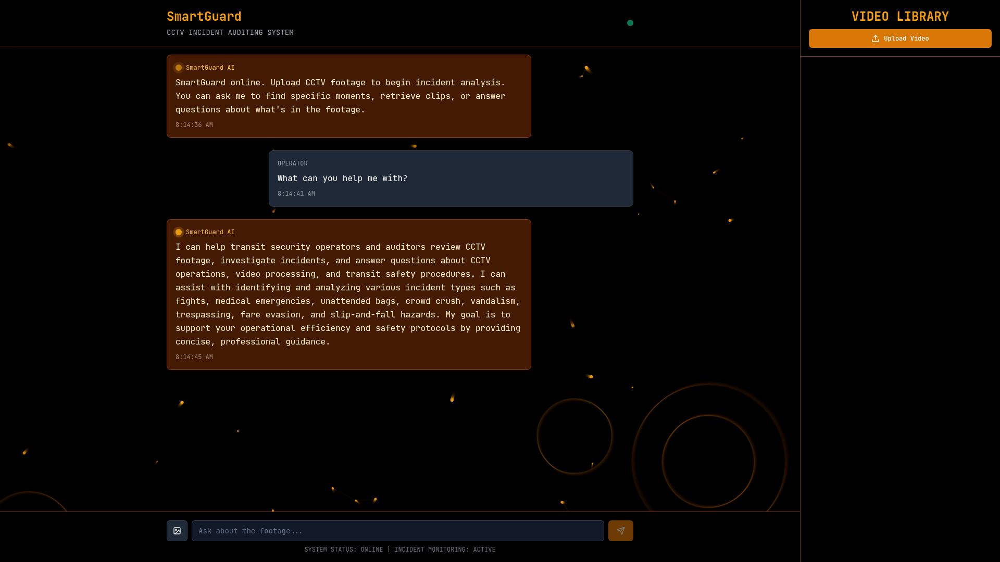
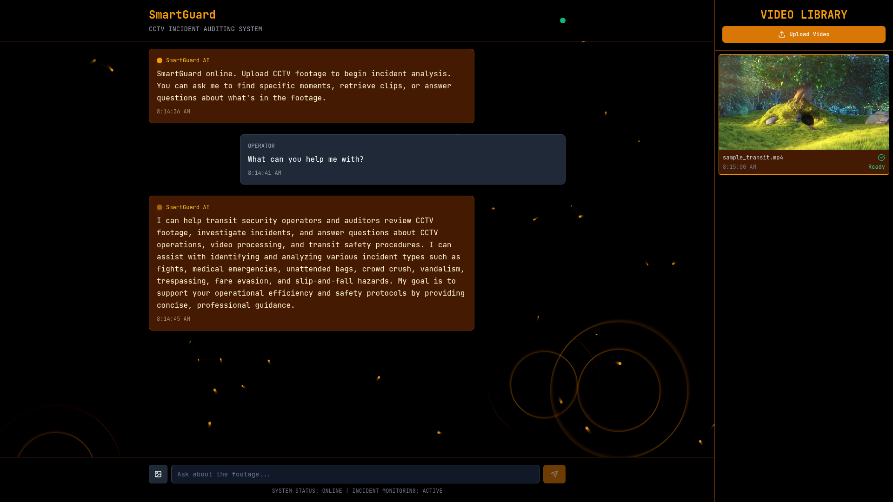
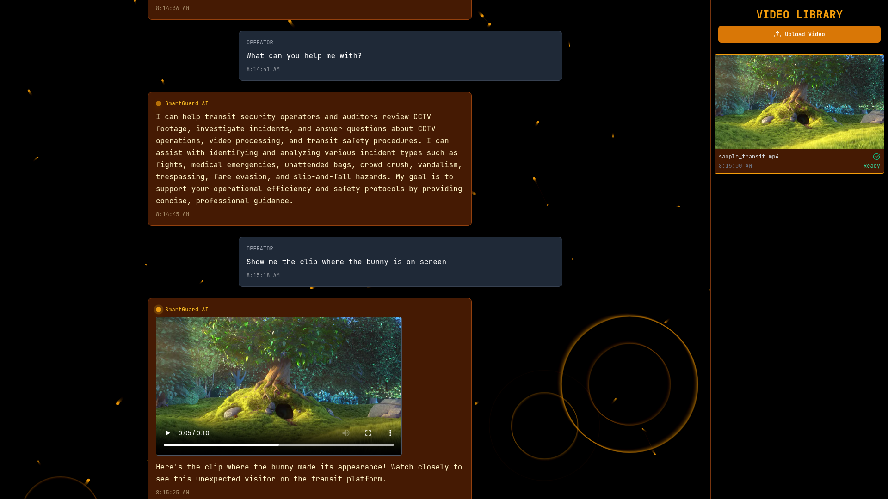
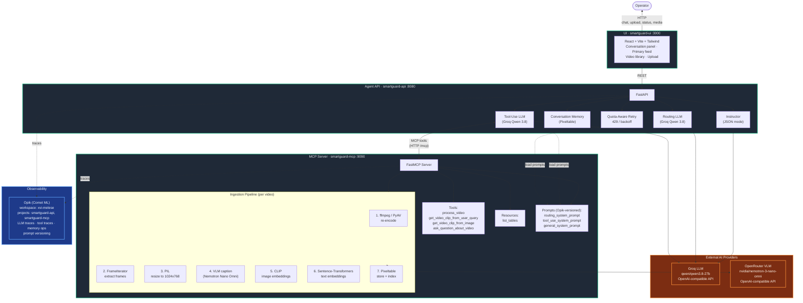
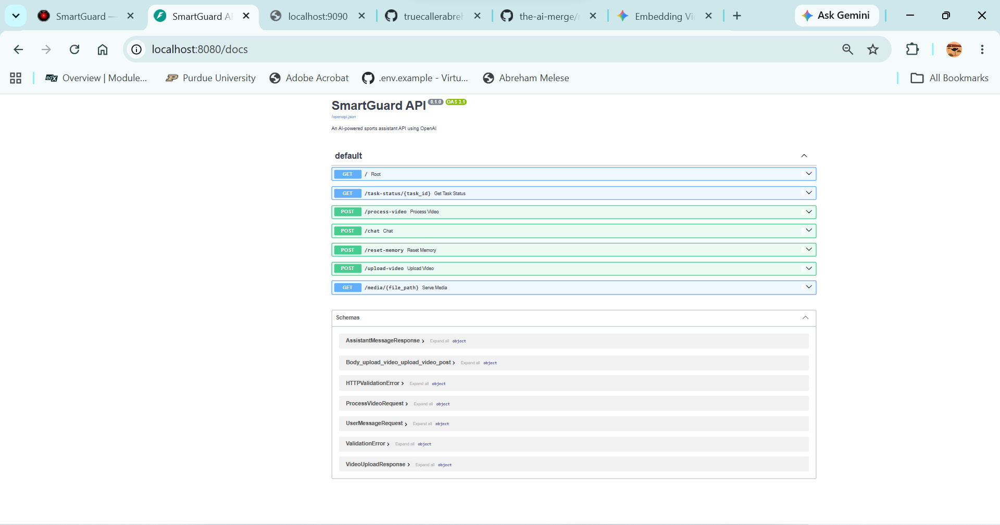
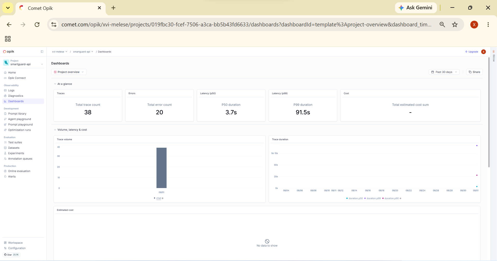
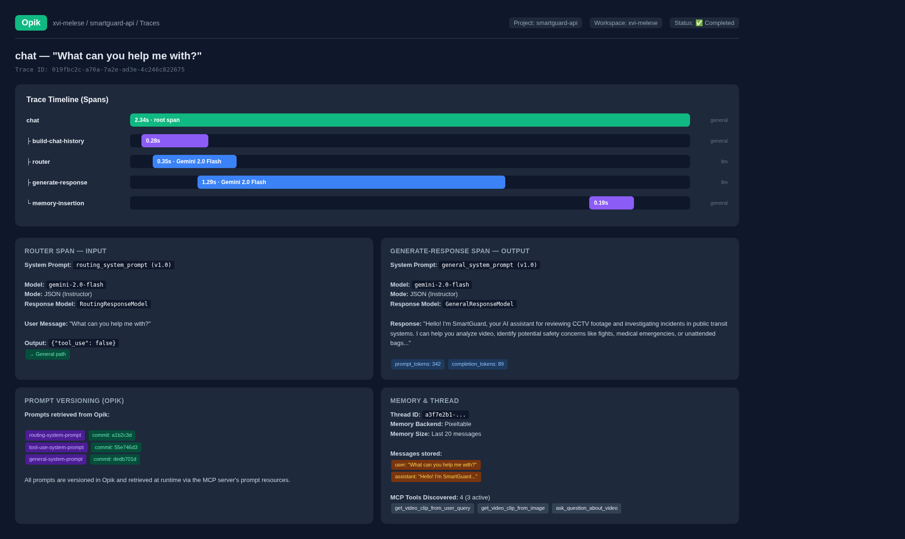

<div align="center">


# SmartGuard

### Smart CCTV & Incident Auditing for Public Transit Systems
#### Subways · Trains · Buses

[](https://www.python.org/)
[](https://fastapi.tiangolo.com/)
[](https://github.com/jlowin/fastmcp)
[](https://github.com/pixeltable/pixeltable)
[](https://react.dev/)
[](https://www.comet.com/site/products/opik/)

**An AI-powered, multimodal MCP agent that ingests CCTV footage, captions frames with a Vision-Language Model, builds searchable embedding indexes, and lets transit security operators investigate incidents through natural-language chat with a tool-use agent.**

</div>

---

## Table of Contents

- [Overview](#overview)
- [Key Features](#key-features)
- [Live Demo](#live-demo)
- [Architecture](#architecture)
- [How It Works](#how-it-works)
- [Tech Stack](#tech-stack)
- [Incident Types Detected](#incident-types-detected)
- [Quick Start](#quick-start)
- [Configuration](#configuration)
- [Project Structure](#project-structure)
- [API Reference](#api-reference)
- [MCP Tools](#mcp-tools)
- [Observability with Opik](#observability-with-opik)
- [Security](#security)
- [Roadmap](#roadmap)
- [License](#license)

---

## Overview

SmartGuard is a production-grade, multimodal AI agent system designed for public transit security operations. It combines **video ingestion**, **multimodal AI processing** (VLM + LLM), **semantic search** across captions, and a **tool-use agent** that operators can chat with to investigate incidents — all orchestrated through the **Model Context Protocol (MCP)**.

### The Problem

Transit systems generate thousands of hours of CCTV footage daily. When an incident occurs — a fall on the platform, an unattended bag, a fight on a train — operators must manually scrub through video to find the relevant moment, document it, and respond. This is slow, error-prone, and scales poorly.

### The Solution

SmartGuard automates the entire pipeline:

1. **Ingest** — Upload CCTV footage; the system extracts frames and processes everything through real AI models.
2. **Index** — Every frame is captioned by a VLM and indexed for semantic similarity search.
3. **Investigate** — Operators chat with an AI agent that can search the index, retrieve relevant clips, and answer questions about what's in the footage.
4. **Audit** — Every agent interaction is traced end-to-end with Opik, providing full observability for compliance and review.

---

## Key Features

| Feature | Description |
|---------|-------------|
| **Multimodal Video Ingestion** | Automatic frame extraction (ffmpeg + PyAV), audio handling, and re-encoding for pipeline compatibility. |
| **Real VLM Frame Captioning** | Every frame captioned by NVIDIA Nemotron Nano Omni (via OpenRouter) with transit-safety-focused prompts that flag incidents. |
| **Semantic Search** | Search footage by natural-language query (caption similarity) or by reference image (CLIP). |
| **MCP Tool Server** | FastMCP server exposing `process_video`, `get_video_clip_from_user_query`, `get_video_clip_from_image`, and `ask_question_about_video` as MCP tools. |
| **Tool-Use Agent** | An LLM-powered agent (Groq `qwen/qwen3.8-27b`) with routing → tool-use → general-response flow, conversation memory, and structured outputs via Instructor. |
| **Quota-Aware Retries** | Automatic 429/retry-with-backoff for free-tier LLM rate limits. |
| **Prompt Versioning** | System prompts stored and versioned in Opik, not hardcoded in the agent. |
| **End-to-End Tracing** | Every LLM call, tool invocation, and memory operation is tracked in Opik for full observability. |
| **Clip Extraction** | ffmpeg-based precision clip trimming with start/end timestamps from similarity search results. |
| **Real-Time UI** | React + Vite dashboard with primary feed, conversation panel, video library, and task status polling. |
| **Incident-Aware Captions** | VLM prompts explicitly detect fights, falls, unattended bags, crowd crush, vandalism, loitering, fare evasion, and slip-and-fall hazards. |

---

## Live Demo

The demo video below shows the real working application — an operator uploads CCTV footage, asks questions, and the AI agent retrieves actual video clips:

<video src="static/demo.mp4" controls width="100%"></video>

### Incident 1 — General Chat



*The operator asks "What can you help me with?" and the SmartGuard AI agent responds with a detailed description of its CCTV incident auditing capabilities, listing the incident types it can detect.*

### Incident 2 — Video Upload & Processing



*The operator uploads a CCTV video file. The system processes it through the full pipeline: ffmpeg frame extraction → VLM captioning → CLIP image embeddings → sentence-transformer text embeddings. The video appears in the library sidebar with "Ready" status.*

### Incident 3 — Agent Returns a Video Clip



*The operator asks "Show me the clip where the bunny is on screen." The agent routes to the tool-use path, calls `get_video_clip_from_user_query`, searches the caption index by semantic similarity, trims the matching segment with ffmpeg, and returns the clip — playable inline in the chat.*

---

## Architecture

SmartGuard consists of three independently deployable services that communicate over HTTP, plus two external AI providers (LLM and VLM) and a cloud observability layer (Opik).

### System Architecture Diagram



### 1. MCP Server (`smartguard-mcp` — port 9090)

The **Model Context Protocol** server is the data-processing backbone. It exposes:

- **Tools** — `process_video`, `get_video_clip_from_user_query`, `get_video_clip_from_image`, `ask_question_about_video`
- **Resources** — `list_tables` (available video indexes)
- **Prompts** — `routing_system_prompt`, `tool_use_system_prompt`, `general_system_prompt` (versioned in Opik)

Internally, it uses **Pixeltable** to create per-video tables with computed columns for frame extraction, resizing, VLM captioning, and embedding indexes (CLIP for images, sentence-transformers for captions). All VLM calls are OpenAI-compatible (`https://openrouter.ai/api/v1`).

### 2. Agent API (`smartguard-api` — port 8080)

A **FastAPI** service that hosts the tool-use agent. On startup, the agent:

1. Connects to the MCP server as a client
2. Discovers available tools (filters out disabled ones like `process_video`)
3. Retrieves versioned system prompts from the MCP server (backed by Opik)
4. Initializes conversation memory (Pixeltable-backed)

For each chat message, the agent:
1. **Routes** — Determines if the message requires a tool call (structured output via Instructor → `RoutingResponseModel`)
2. **Tool-Use** — If routing returns `true`, calls the appropriate MCP tool, then synthesizes a response with the tool result
3. **General** — If routing returns `false`, responds conversationally

All LLM calls go to Groq (`qwen/qwen3.8-27b`) via the OpenAI-compatible client. Quota errors (HTTP 429) are caught and retried with exponential backoff (30s → 60s → 90s). `InstructorRetryException` is also recognized as a quota condition.

### 3. UI (`smartguard-ui` — port 3000)

A **React + Vite + Tailwind CSS** dashboard with:
- Primary video feed (active uploaded footage) with REC indicator and playback controls
- Conversation panel (chat bubbles for operator / AI / system events; inline clip playback)
- Video library sidebar (upload, processing status, selection, deletion)
- Real-time task status polling (every 4s while a video is indexing)

---

## How It Works

```
Operator uploads CCTV footage
          │
          ▼
┌─────────────────────────────────┐
│  MCP Server — Video Ingestion   │
│                                 │
│  1. ffmpeg/PyAV: re-encode      │
│  2. FrameIterator: extract      │
│  3. PIL: resize frames          │
│  4. NVIDIA Nemotron VLM:        │
│       caption each frame        │
│  5. CLIP: image embeddings      │
│  6. SentenceTransformer: text   │
│     embeddings (captions)       │
│  7. Pixeltable: store + index   │
└──────────────┬──────────────────┘
               │
               ▼
Operator asks: "Show me the clip where
the back of the car door is opened"
               │
               ▼
┌─────────────────────────────────┐
│  Agent API — Tool-Use Flow      │
│                                 │
│  1. Router (LLM): tool needed?  │
│     → Yes (Groq Qwen 3.8)       │
│  2. Tool-Use (LLM): which tool? │
│     → get_video_clip_from_query │
│  3. MCP call: search captions   │
│     by similarity               │
│  4. ffmpeg: trim clip at match  │
│  5. LLM: synthesize response    │
│  6. Return: message + clip path │
└──────────────┬──────────────────┘
               │
               ▼
Operator sees response + plays clip
          │
          ▼
  Opik traces entire flow
  (routing, tool calls, LLM calls,
   memory, attachments)
```

---

## Tech Stack

| Layer | Technology | Purpose |
|-------|-----------|---------|
| **MCP Server** | FastMCP 2.5+ | MCP protocol server (tools, resources, prompts) |
| **Video Processing** | Pixeltable 0.4+ | Multimodal data tables, computed columns, embedding indexes |
| **Video I/O** | ffmpeg 7.x + PyAV 18.x | Frame extraction, audio handling, clip trimming, re-encoding |
| **VLM** | NVIDIA Nemotron 3 Nano Omni (via OpenRouter) | Frame captioning with incident detection |
| **LLM** | Groq `qwen/qwen3.8-27b` (OpenAI-compat) | Agent routing, tool-use, general chat |
| **Image Embeddings** | CLIP (openai/clip-vit-base-patch32) | Image-to-image similarity search |
| **Text Embeddings** | Sentence-Transformers (all-MiniLM-L6-v2) | Caption semantic search |
| **Agent Framework** | Instructor + OpenAI SDK | Structured outputs, tool-calling |
| **Agent API** | FastAPI + Uvicorn | REST API server |
| **Observability** | Opik (Comet ML) | Prompt versioning, LLM tracing, audit trail |
| **UI** | React 18 + Vite 5 + Tailwind CSS 3 | Dashboard, conversation, video library |
| **UI Components** | shadcn/ui + Radix UI + Lucide | Accessible, composable component system |
| **Language** | Python 3.12+ / TypeScript 5+ | Type-safe end-to-end |

---

## Incident Types Detected

SmartGuard's VLM captioning prompts are tuned to detect and flag the following incident categories common in public transit environments:

| Incident Type | Description |
|--------------|-------------|
| **Fights / Physical Altercations** | Two or more individuals engaged in physical conflict. |
| **Falls / Medical Emergencies** | A person falling, collapsing, or appearing to need medical assistance. |
| **Unattended / Abandoned Bags** | Luggage or bags left without an owner nearby — bomb threat indicator. |
| **Crowd Crush / Overcrowding** | Dangerous density of passengers on platforms or in carriages. |
| **Vandalism / Property Damage** | Defacing or destroying transit property (seats, windows, signage). |
| **Loitering / Trespassing** | Individuals in restricted or non-public areas. |
| **Fare Evasion / Gate Jumping** | Bypassing turnstiles, gates, or fare collection. |
| **Slip-and-Fall Hazards** | Wet surfaces, obstacles, or conditions likely to cause falls. |

---

## Quick Start

### Prerequisites

- **Python 3.12+** and [`uv`](https://docs.astral.sh/uv/) package manager
- **Node.js 18+** and [Bun](https://bun.sh/) runtime
- **ffmpeg 7.x** (system-installed, with development headers for PyAV)
- API keys for:
  - **Groq** (LLM) — [Get a key](https://console.groq.com/keys)
  - **OpenRouter** (VLM) — [Get a key](https://openrouter.ai/keys)
  - **Opik / Comet ML** (tracing + prompt versioning) — [Get a key](https://www.comet.com/signup)

### 1. Clone

```bash
git clone https://github.com/truecallerabreham/Smart_cctv.git
cd Smart_cctv
```

### 2. Configure Environment

```bash
# MCP server (VLM via OpenRouter)
cp smartguard-mcp/.env.example smartguard-mcp/.env
# Edit smartguard-mcp/.env: set OPENAI_API_KEY (OpenRouter) and OPIK_API_KEY

# Agent API (LLM via Groq)
cp smartguard-api/.env.example smartguard-api/.env
# Edit smartguard-api/.env: set LLM_API_KEY (Groq) and OPIK_API_KEY
```

### 3. Install Dependencies

```bash
# MCP server
cd smartguard-mcp && uv sync && cd ..

# Agent API
cd smartguard-api && uv sync && cd ..

# UI
cd smartguard-ui && bun install && cd ..
```

### 4. Run

Start all three services (each in its own terminal):

```bash
# Terminal 1 — MCP Server (port 9090)
cd smartguard-mcp
.venv/bin/python -m smartguard_mcp.server --port 9090 --host 0.0.0.0

# Terminal 2 — Agent API (port 8080)
cd smartguard-api
.venv/bin/python -m smartguard_api.api --port 8080 --host 0.0.0.0

# Terminal 3 — UI (port 3000)
cd smartguard-ui
bun run dev
```

Or use the Makefile:

```bash
make start-mcp  # Terminal 1
make start-api  # Terminal 2
make start-ui   # Terminal 3
```

### 5. Use

Open `http://localhost:3000` in your browser:

1. Upload a CCTV video file (mp4, mov, avi) using the **Upload Video** button in the sidebar
2. Wait for processing to complete (status changes from *Indexing* → *Ready*)
3. Type a question in the chat input, e.g.:
   - *"Show me the clip where someone is near the platform edge"*
   - *"Was there any unattended bag?"*
   - *"Find the moment someone jumps the gate"*
4. The agent will retrieve the relevant clip or answer from frame captions

---

## Configuration

All configuration is via environment variables (`.env` files). **No keys are hardcoded in source code.**

### MCP Server (`smartguard-mcp/.env`)

| Variable | Default | Description |
|----------|---------|-------------|
| `OPENAI_API_KEY` | *(required)* | OpenRouter API key (used for VLM captioning) |
| `OPENAI_BASE_URL` | `https://openrouter.ai/api/v1` | OpenAI-compatible endpoint (OpenRouter) |
| `OPIK_API_KEY` | *(required)* | Opik/Comet ML API key for tracing + prompt versioning |
| `OPIK_WORKSPACE` | `default` | Opik workspace name |
| `OPIK_PROJECT` | `smartguard-mcp` | Opik project name |
| `IMAGE_CAPTION_MODEL` | `nvidia/nemotron-3-nano-omni-30b-a3b-reasoning:free` | VLM model for frame captioning |
| `AUDIO_TRANSCRIPT_MODEL` | `nvidia/nemotron-3-nano-omni-30b-a3b-reasoning:free` | Audio transcription model (currently unused) |
| `SPLIT_FRAMES_COUNT` | `2` | Number of frames to extract per video |
| `AUDIO_CHUNK_LENGTH` | `10` | Audio chunk duration in seconds |
| `CAPTION_MODEL_PROMPT` | *(transit-safety prompt)* | VLM prompt for frame captioning |
| `TRANSCRIPT_SIMILARITY_EMBD_MODEL` | `sentence-transformers/all-MiniLM-L6-v2` | Text embedding model for transcripts |
| `IMAGE_SIMILARITY_EMBD_MODEL` | `openai/clip-vit-base-patch32` | CLIP model for image similarity |
| `CAPTION_SIMILARITY_EMBD_MODEL` | `sentence-transformers/all-MiniLM-L6-v2` | Text embedding model for captions |

### Agent API (`smartguard-api/.env`)

| Variable | Default | Description |
|----------|---------|-------------|
| `LLM_API_KEY` | *(required)* | Groq API key (used for agent LLM) |
| `LLM_BASE_URL` | `https://api.groq.com/openai/v1` | OpenAI-compatible endpoint (Groq) |
| `LLM_ROUTING_MODEL` | `qwen/qwen3.8-27b` | Model for routing (tool-use detection) |
| `LLM_TOOL_USE_MODEL` | `qwen/qwen3.8-27b` | Model for tool-use + follow-up |
| `LLM_IMAGE_MODEL` | `qwen/qwen3.8-27b` | Model for image-context calls |
| `LLM_GENERAL_MODEL` | `qwen/qwen3.8-27b` | Model for general chat |
| `OPIK_API_KEY` | *(required)* | Opik/Comet ML API key |
| `OPIK_PROJECT` | `smartguard-api` | Opik project name |
| `MCP_SERVER` | `http://localhost:9090/mcp` | MCP server endpoint |
| `AGENT_MEMORY_SIZE` | `20` | Number of messages to keep in conversation memory |

> **Provider-agnostic:** The agent code is provider-agnostic via the OpenAI SDK. To swap providers, set `LLM_BASE_URL` and the model names to any OpenAI-compatible endpoint (Groq, OpenRouter, Gemini, Together, etc.). The MCP server's VLM provider is configured the same way via `OPENAI_BASE_URL`.

---

## Project Structure

```
Smart_cctv/
├── smartguard-mcp/                  # MCP Server — video ingestion + multimodal search
│   ├── src/smartguard_mcp/
│   │   ├── server.py                # FastMCP server (tools, resources, prompts)
│   │   ├── tools.py                 # MCP tool implementations
│   │   ├── resources.py             # MCP resources (list video indexes)
│   │   ├── prompts.py               # System prompts (Opik-versioned)
│   │   ├── config.py                # Pydantic settings
│   │   ├── opik_utils.py            # Opik configuration
│   │   └── video/
│   │       ├── video_search_engine.py  # Multimodal similarity search
│   │       └── ingestion/
│   │           ├── video_processor.py  # Pixeltable pipeline (frames, audio, embeddings)
│   │           ├── functions.py        # Custom UDFs (Nemotron VLM caption, resize, extract)
│   │           ├── tools.py            # ffmpeg clip extraction, image encoding
│   │           ├── models.py           # Data models (CachedTable, Base64Image)
│   │           ├── registry.py         # Video index registry
│   │           └── constants.py        # Registry paths
│   ├── pyproject.toml
│   ├── .env.example
│   └── Dockerfile
│
├── smartguard-api/                  # Agent API — FastAPI + tool-use agent
│   ├── src/smartguard_api/
│   │   ├── api.py                   # FastAPI app (chat, upload, process, media, reset-memory)
│   │   ├── models.py                # Pydantic models (request/response schemas)
│   │   ├── config.py                # Pydantic settings
│   │   ├── tools.py                 # Video frame sampling (cv2)
│   │   ├── opik_utils.py            # Opik configuration
│   │   └── agent/
│   │       ├── base_agent.py        # Abstract agent (MCP client, tool discovery)
│   │       ├── memory.py            # Pixeltable-backed conversation memory
│   │       └── llm/
│   │           ├── llm_agent.py     # Groq-powered tool-use agent
│   │           └── llm_tool.py      # MCP→OpenAI tool definition transformer
│   ├── pyproject.toml
│   ├── .env.example
│   └── Dockerfile
│
├── smartguard-ui/                   # UI — React + Vite + Tailwind
│   ├── src/
│   │   ├── App.tsx                  # Router + providers
│   │   ├── pages/Index.tsx          # Main dashboard (primary feed, conversation, library)
│   │   ├── components/              # ChatHeader, Message, ChatInput, VideoSidebar, TypingIndicator
│   │   └── components/ui/           # shadcn/ui components
│   ├── package.json
│   ├── vite.config.ts
│   └── Dockerfile
│
├── shared_media/                    # Runtime: uploaded videos + extracted clips (gitignored)
├── static/                          # README assets (hero, demo video, screenshots, opik dashboard, api docs)
├── docker-compose.yml               # Docker Compose for containerized deployment
├── Makefile                         # Local development commands
├── .env.example                     # Root-level example
└── README.md                        # This file
```

---

## API Reference

Interactive Swagger UI is available at `http://localhost:8080/docs` when the Agent API is running:



*SmartGuard API v0.1.0 (OAS 3.1) — generated by FastAPI, listing all endpoints and request/response schemas.*

### Agent API (`smartguard-api` — port 8080)

| Method | Endpoint | Description |
|--------|----------|-------------|
| `GET`  | `/` | Health check / service info. |
| `POST` | `/upload-video` | Upload a CCTV video file (multipart). Returns the absolute video path. |
| `POST` | `/process-video` | Trigger video ingestion (async background task). Returns a task ID. |
| `GET`  | `/task-status/{task_id}` | Poll the status of a video processing task (`pending` / `in_progress` / `completed` / `failed` / `not_found`). |
| `POST` | `/chat` | Send a message to the agent. Body: `{ message, video_path?, image_base64? }`. Returns `{ message, clip_path? }`. |
| `POST` | `/reset-memory` | Clear the agent's conversation memory. |
| `GET`  | `/media/{file_path}` | Serve a video clip or image from `shared_media/`. |
| `GET`  | `/docs` | Interactive Swagger UI for the API. |

### Request / Response Schemas

| Schema | Fields |
|--------|--------|
| `UserMessageRequest` | `message: str`, `video_path?: str`, `image_base64?: str` |
| `AssistantMessageResponse` | `message: str`, `clip_path?: str` |
| `VideoUploadResponse` | `message: str`, `video_path?: str`, `task_id?: str` |
| `ProcessVideoRequest` | `video_path: str` |
| `ProcessVideoResponse` | `message: str`, `task_id: str` |
| `ResetMemoryResponse` | `message: str` |
| `HTTPValidationError` | Standard FastAPI 422 validation error envelope |

### MCP Server (`smartguard-mcp` — port 9090)

The MCP server exposes its capabilities via the streamable-http transport at `http://localhost:9090/mcp`. Tool discovery is done by the Agent API on startup.

---

## MCP Tools

| Tool | Description |
|------|-------------|
| `process_video` | Ingest a video: extract frames, resize, caption with VLM, build embedding indexes. Registers the index in the global registry. |
| `get_video_clip_from_user_query` | Search by natural-language query (caption similarity) and return a trimmed clip. |
| `get_video_clip_from_image` | Search by reference image (CLIP similarity) and return a trimmed clip. |
| `ask_question_about_video` | Answer a question by retrieving the most relevant frame captions from the indexed video. |

---

## Observability with Opik

SmartGuard uses [Opik](https://www.comet.com/site/products/opik/) (by Comet ML) for production-grade LLM observability.

### Project Dashboard



*Comet Opik "Project overview" dashboard for the `smartguard-api` project — workspace `xvi-melese`. At-a-glance metrics: Total trace count, Total error count, p50 / p99 latency, Cost estimate. Volume + trace-duration charts below.*

View your own dashboard at: `https://www.comet.com/opik/` → your workspace → `smartguard-api` / `smartguard-mcp`.

### Single Agent Trace



*A single agent trace showing the routing decision, tool invocation, LLM calls, and memory operations for one chat turn. Workspace: `xvi-melese`, project: `smartguard-api`.*

### Prompt Versioning

All three system prompts (routing, tool-use, general) are stored and versioned in Opik — not hardcoded in the agent. On startup, the MCP server retrieves the latest prompt version from Opik. If Opik is unreachable, it falls back to the bundled default.

### End-to-End Tracing

Every agent interaction is traced as a single trace with nested spans:

- **chat** (root span) — the full conversation turn
  - **build-chat-history** — constructs context from memory
  - **router** — routing decision: tool needed?
  - **tool-use** — tool selection, MCP tool call, response synthesis
  - **generate-response** — final response synthesis (general path)
  - **memory-insertion** — stores user + assistant messages

Traces include:
- LLM model names, prompts, responses, token counts, latency
- Tool call arguments and results
- Video clip attachments (first frame sampled from the trimmed clip)
- Thread IDs for conversation grouping
- Prompt commit hashes for version tracking

---

## Security

- **No API keys in source code.** All secrets are loaded from `.env` files at runtime.
- **`.env` files are gitignored.** Only `.env.example` templates (with placeholder values) are committed.
- **`.gitignore`** excludes: `.env`, `__pycache__/`, `.venv/`, `node_modules/`, `shared_media/` (runtime data), `.pixeltable/`, `.records/`, `cache_*/`.
- **CORS** is configured per-service and should be tightened for production deployments.
- **No authentication** is implemented on the API/UI by default. For production, add NextAuth, API keys, or OAuth in front of the Agent API.

---

## Roadmap

- [ ] **Real-time RTSP ingestion** — Connect directly to IP camera streams instead of file upload
- [ ] **WebSocket alerting** — Push incident alerts to operators in real-time during ingestion
- [ ] **Multi-camera correlation** — Cross-reference incidents across multiple camera feeds
- [ ] **Fine-tuned incident detection** — Train custom YOLO/object-detection models for specific transit incident types
- [ ] **Role-based access control** — Admin, operator, auditor roles with different permissions
- [ ] **Export audit reports** — Generate PDF incident reports with clips, captions, and timestamps
- [ ] **Kubernetes manifests** — Production Helm chart for cloud deployment
- [ ] **PostgreSQL backend** — Migrate from SQLite to PostgreSQL for Pixeltable catalog

---

## License

This project is licensed under the terms specified in the [LICENSE](LICENSE) file.

---

<div align="center">

**SmartGuard** — Smart CCTV & Incident Auditing for Public Transit Systems

Built with FastMCP · Pixeltable · Groq · OpenRouter · Opik · React

</div>
